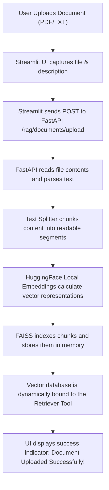
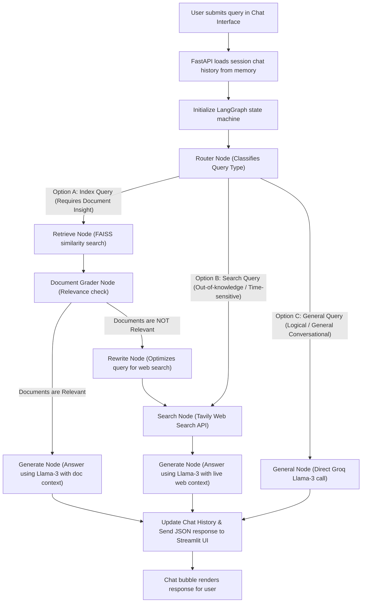

# Adaptive RAG - System Architecture & Technical Flow

This document provides a detailed technical overview of the **Adaptive RAG** system. It details the high-performance local architecture, followed by visual flowcharts and technical breakdowns of the document ingestion and query routing workflows.

---

## 📋 Core Architectural Principles & Component Stack

The system is engineered as a high-speed, cost-effective, and fully local/hybrid Retrieval-Augmented Generation (RAG) pipeline. It operates without heavy external cloud databases or paid API billing dependencies.

| Architectural Component | Technology | Technical Purpose & Value |
| :--- | :--- | :--- |
| **Orchestration Brain** | **LangGraph** | Models dynamic query-routing and self-correcting logic via a stateful, cyclic workflow. |
| **Vector Search Engine** | **FAISS (Local CPU Index)** | Direct in-memory similarity indexing, eliminating the overhead of external database servers. |
| **Text Embeddings** | **HuggingFace (`all-MiniLM-L6-v2`)** | 100% free, offline, local vector calculations with zero API call overhead. |
| **Large Language Model** | **Groq Llama-3** | Delivers ultra-low latency open-source reasoning via Groq's high-speed API engine. |
| **Session Memory** | **Async In-Memory History** | An asynchronous, non-blocking stack that tracks conversation context thread-by-thread. |
| **API Framework** | **FastAPI** | High-throughput asynchronous REST API separating business logic from client interfaces. |
| **User Interface** | **Streamlit** | Responsive, lightweight chat dashboard featuring file uploads and real-time outputs. |

---

## 🔄 System Workflows & Flowcharts

The system operates on two core pipelines: **Document Upload & Ingestion** and **Dynamic Query Routing (Agentic RAG)**.

### 1. Document Upload & Ingestion Flow
This flow is triggered when a document (such as a resume or text file) is uploaded through the Streamlit interface.

---

### 2. Dynamic Query Routing (LangGraph) Flow
This flowchart represents the stateful query execution graph engineered with **LangGraph**. It intelligently selects the most contextually relevant path to answer any question.

---

## 🎯 Key Engineering Highlights

1. **Self-Correcting RAG:** The system does not blindly rely on vector store results. If retrieved document segments grade low on relevance, the agent autonomously rewrites the query and executes an external Tavily web search.
2. **Decoupled System Boundaries:** Separating the FastAPI backend from the Streamlit frontend ensures high throughput, cleanly isolating front-end rendering from back-end AI computations.
3. **High-Performance Open-Source Inference:** Utilizing the Groq Llama-3 API allows responses to be generated in milliseconds, proving that open-source RAG architectures can deliver commercial-grade speed and accuracy without high operation costs.
